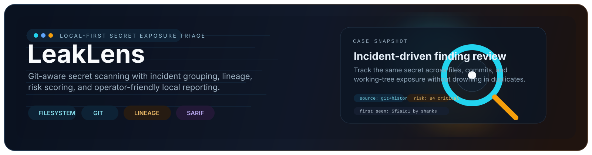

# <div align="center">LeakLens</div>

<div align="center">
  
</div>

<div align="center">


</div>

LeakLens is a local-first secret exposure scanner written in Rust. It scans filesystems, git working trees, and git history; groups repeated leaks into incidents; attributes first-seen and last-seen commits; scores risk; and generates operator-friendly JSON, HTML, and SARIF output.

It is designed to feel sharper and more explainable than a plain regex dump:

- git-aware instead of working-tree-only
- incident and lineage tracking instead of duplicate finding spam
- confidence and risk scoring instead of flat severity only
- AI-style triage summaries without requiring a remote model
- report output made for local investigation and CI handoff

## Why LeakLens

LeakLens sits in the same problem space as tools like TruffleHog and Gitleaks, but the project focus is different:

| Area | LeakLens direction |
| --- | --- |
| Core language | Rust workspace |
| Primary workflow | Local triage first, CI second |
| Scan focus | Files, repos, and history |
| Output style | Human-readable investigation plus machine-readable artifacts |
| Differentiator | Incident grouping, lineage, AI-style explanation, risk scoring |

## What It Does

### Scan modes

- Local filesystem scanning
- Git working tree scanning
- Git history scanning
- History-only mode for finding secrets removed from the current tree

### Detection and scoring

- Provider-specific detectors for common credentials and tokens
- Generic plaintext secret assignment detection
- Entropy-aware confidence adjustments
- Path-context scoring for runtime config versus docs/examples
- Deduplication that prefers more specific detectors over generic hits

### Triage and reporting

- Incident IDs for grouping the same secret across files and commits
- First-seen / last-seen commit metadata
- Working-tree versus history presence flags
- Risk score from 0-100
- Heuristic AI triage with explanation and next steps
- JSON, HTML, and SARIF output

## Current Detector Coverage

LeakLens currently ships with detectors for:

- GitHub tokens
- GitLab tokens
- AWS access keys
- Slack tokens and Slack webhooks
- Discord tokens and Discord webhooks
- Google API keys
- Stripe keys
- OpenAI API keys
- Anthropic API keys
- Hugging Face tokens
- SendGrid API keys
- Terraform Cloud tokens
- PyPI tokens
- Azure connection strings
- NPM tokens
- JWTs
- bearer tokens
- database URLs with embedded credentials
- private key headers
- generic secret assignment patterns such as `db_password`, `api_token`, and `connection_string`

## Project Layout

```text
leaklens/
  assets/
  crates/
    cli/         # command-line interface and scan entrypoints
    core/        # scan engine, git traversal, scoring, models
    detectors/   # detector pack and redaction helpers
    reporters/   # JSON, HTML, SARIF writers
    ai/          # local heuristic triage/explanation layer
    validators/  # placeholder crate for future validation work
  docs/
```

## Quick Start

### Requirements

- Rust toolchain via `rustup`
- Git available on `PATH` if you want git repo / history scanning

### Build or run

```powershell
cd F:\dev\cv_output\leaklens
cargo run -p leaklens-cli -- scan . --exclude */target/* --exclude */reports/*
```

### Common commands

```powershell
# Scan a normal directory recursively
cargo run -p leaklens-cli -- scan .\some-folder

# Scan a git repo working tree
cargo run -p leaklens-cli -- scan .\some-repo

# Scan current files plus git history
cargo run -p leaklens-cli -- scan .\some-repo --history

# Scan only history
cargo run -p leaklens-cli -- scan .\some-repo --history-only

# Console-only triage without writing reports
cargo run -p leaklens-cli -- scan .\some-repo --history --summary-only
```

More examples live in [docs/COMMANDS.md](docs/COMMANDS.md).

## Reporting

LeakLens can emit:

- `JSON` for scripting and post-processing
- `HTML` for local review and sharing results
- `SARIF` for code-scanning and CI workflows

Example:

```powershell
cargo run -p leaklens-cli -- scan .\some-repo --history `
  --json .\reports\scan.json `
  --html .\reports\scan.html `
  --sarif .\reports\scan.sarif
```

Each finding includes:

- detector name and secret type
- redacted value preview
- source file and line
- severity and confidence
- risk score
- working-tree versus history origin
- incident grouping metadata
- first-seen / last-seen commit metadata when available
- heuristic triage explanation and next-step guidance

## Scope Control and Noise Reduction

LeakLens supports several ways to reduce noise:

- `--ignore-file` to skip wildcard path patterns from a file
- `--baseline` to suppress findings already present in a prior LeakLens JSON report
- `--include` and `--exclude` for ad-hoc path scoping
- `--no-recursive` and `--max-depth` for shallow scans
- built-in ignored directories such as `.git`, `node_modules`, `target`, `.venv`, `vendor`, and `dist`

Example:

```powershell
cargo run -p leaklens-cli -- scan .\some-repo --history `
  --ignore-file .\docs\leaklensignore.example `
  --baseline .\reports\previous.json `
  --exclude */vendor/* `
  --exclude *.pem
```

## Testing Against Safe Public Corpora

LeakLens does not bundle live or semi-live secret data. For safe testing, clone intentionally fake or curated fixtures and scan them locally.

```powershell
cd F:\labs
git clone https://github.com/Yelp/detect-secrets.git
git clone https://github.com/awslabs/git-secrets.git
git clone https://github.com/gitleaks/fake-leaks.git
```

Then run:

```powershell
cd F:\dev\cv_output\leaklens
cargo run -p leaklens-cli -- scan F:\labs\detect-secrets\test_data
cargo run -p leaklens-cli -- scan F:\labs\git-secrets\test
cargo run -p leaklens-cli -- scan F:\labs\fake-leaks --history --summary-only
```

## Design Notes

### Local-first by default

LeakLens is built for local operation. The current AI layer is heuristic and does not require a remote provider.

### Explainability over magic

The project tries to make every finding easier to reason about:

- why it fired
- where it first appeared
- whether it still exists in the live tree
- what the operator should do next

### Git-aware triage

The same secret appearing across files and commits should feel like one incident, not twenty unrelated matches. LeakLens groups and attributes that lineage so cleanup work is easier to prioritize.

## Status

LeakLens is currently a strong MVP:

- scan engine is in place
- git working tree and history scanning work
- the detector pack is useful today
- HTML/JSON/SARIF reporting is already usable
- incident grouping and lineage are implemented

The next major upgrades are tracked in [docs/ROADMAP.md](docs/ROADMAP.md).

## Safety and Operational Notes

- Use LeakLens against repositories and data you are authorized to inspect.
- Rotate and revoke any real secrets you intentionally use in local lab material.
- Treat exposed private keys as compromised, not just "interesting."
- History findings often matter even after the working tree looks clean.

## Related Files

- [docs/COMMANDS.md](docs/COMMANDS.md) - copy-paste command cheat sheet
- [docs/leaklensignore.example](docs/leaklensignore.example) - ignore-file example
- [docs/ROADMAP.md](docs/ROADMAP.md) - upcoming work

## License

MIT
